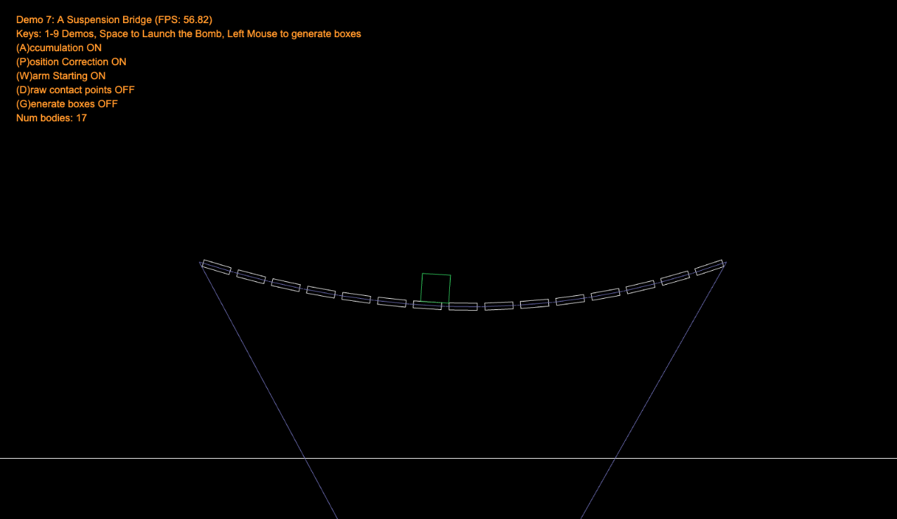

# js-box2d-lite

A JavaScript port of Erin Catto’s **box2d-lite**.  
This is a near 1-to-1 port of the original C++ code, with little to no focus on JavaScript-specific performance optimizations. An optimized version may be explored in the future (for example, using scalar math instead of frequent object allocations).

Original C++ implementation:  
https://github.com/erincatto/box2d-lite

# How to run

## Prerequisites

- Node.js installed

## Install dependencies

```
npm install
```

## Run

```
npm start
```

Now open the browser at http://localhost:1234

# Physics demos

As in the original box2d-lite, this project includes a set of demos demonstrating how the physics engine works.

